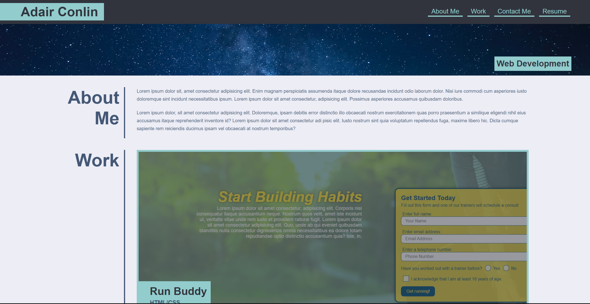

# Professional Portfolio - Challenge
## Description
The goal for this project was to build a portfolio page from scratch based on the given mockup. It had to fit the acceptance criteria, which mainly included matching the given mockup as well as adding a responsive layout that adapts to different viewports. 

In this project, I used flexbox and several pseudo class slectors in order to emulate what the mockup visualized. While flexbox made the page responsive on it's own, I also included different CSS properties for specific smaller screen sizes so that the looks of the website remained professional and easier to control. 

### This is the mockup that was given

### You can view my project's end result [here](https://adairconlin.art/professional-portfolio/)

